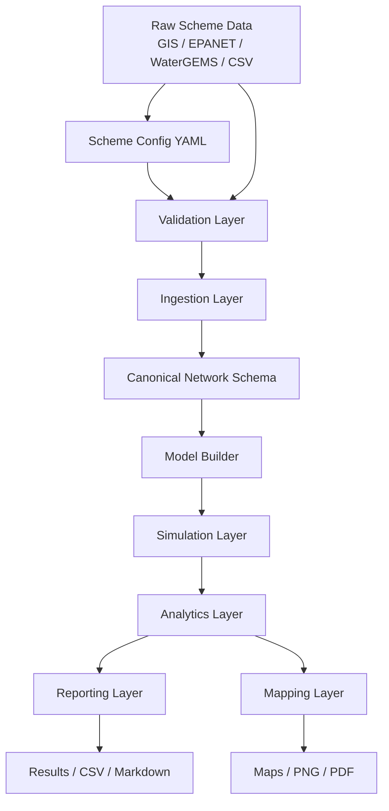

# System Architecture

## Overview

The repository now follows a two-track architecture:

- private training archive
- fresh generalized toolkit scaffold

## Architecture Diagram



## Visual Pipeline

```text
Raw scheme files
   -> scheme configuration
   -> validation
   -> field mapping
   -> canonical asset tables
   -> hydraulic model build
   -> simulation
   -> metrics
   -> reports and maps
```

## Component Roles

### Private training archive

Training-only artifacts are excluded from generated designs and public outputs.

### New generalized root

The root project provides:

- standard configuration layout
- reusable package structure
- generalized command workflow
- templates for onboarding new schemes

## Package Layering

```text
cli
  -> config
  -> validation
  -> ingestion
  -> modeling
  -> analysis
  -> mapping
  -> reporting
```

## Intended Evolution

The scaffold is designed so we can later add:

- GIS adapters
- EPANET adapters
- WaterGEMS SQLite adapters
- canonical schema conversion
- scenario engine
- calibration tools
- IoT / SCADA integration
