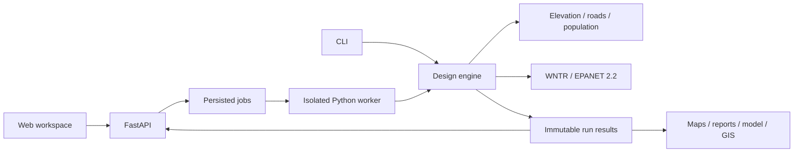

# DharaNokxa — UI and implementation plan

Prepared 26 September 2026. This document plans implementation; it does not claim that the application or hydraulic engine is complete.

## 1. Product direction

Build a guided setup followed by a map-centered engineering workspace. The field team supplies facts; the software creates, tests, corrects, and documents a candidate; the engineer reviews the evidence.

Three interface directions were considered:

| Direction | Strength | Weakness | Decision |
|---|---|---|---|
| Wizard throughout | Easy first use | Interrupts map/table comparison | Use only for initial setup |
| GIS workstation throughout | Efficient expert inspection | Too many controls for field input | Use progressive disclosure in results |
| Chat-first design | Helpful explanations | Poor precision for coordinates, tables, and revisions | Optional later assistance, never the authoritative control surface |

Recommended hybrid: **three required inputs, one primary action, a persistent map, and evidence on demand**.

## 2. Existing project and migration

Inspected README, package metadata, pipeline, validation, architecture, and root file layout. The generalized `water_scheme_toolkit` currently provides configuration, validation, and CLI scaffolding. Its build/simulate/analyze/map/report commands print placeholder messages. There is no frontend or API in the inspected root inventory.

Reuse the configuration and CLI foundations. Audit legacy hydraulic routines individually before extracting reusable behavior. Preserve `legacy/jorhat_project` byte-for-byte; run regressions using working copies outside that directory.

A `.git` entry exists, but `git status` currently reports that this is not a Git repository. Inspect that entry before repository initialization; do not overwrite it blindly. Public publication is an implementation milestone, not part of preparing this plan.

## 3. User inputs

### New design

Desktop: a compact form beside a live map. Mobile: form first, with a clearly labeled map picker that opens full screen.

Required controls:

1. **Scheme name** — plain text, autosaved draft.
2. **ESR location** — Pick on map, or explicitly labeled Latitude / Longitude fields. Show the selected point and coordinates together.
3. **Household CSV** — upload area, Download template, and Generate dummy scheme.

Primary action: **Generate hydraulic design**. Below it show the active profile and a short assumptions summary. An expandable **Engineering assumptions** panel holds expert controls, their sources, and override reasons.

The three-field CSV remains `household_id,latitude,longitude`; optional population is accepted. Keep original and normalized inputs downloadable. Provide column mapping when headers differ, preview changes, and never silently swap coordinates or drop households.

Validate inline: missing identifiers, duplicate identifiers, invalid coordinates, suspicious coordinate swaps, missing values, outliers, and unconnected households. Distinguish blocking errors from reviewable warnings. Each issue links to its row and map position; allow download of an error CSV. Retain the draft after failure.

### Input review without another mandatory form

After validation, show household count, population source, demand, elevation range, and source location in the same workspace. Continue automatically when inputs are valid. Pause only for a blocking issue; keep the enrichment assumptions visible throughout.

Show provenance labels next to values: Surveyed, Authoritative, Derived, Open data, Assumed, Synthetic. Describe missing coverage directly. Do not replace provider failures with synthetic values in a real scheme.

### Source-head workflow

Default New scheme mode may recommend a source hydraulic level using documented assumptions and a bounded preliminary design procedure. Show: ground level, assumed minimum operating water level, required hydraulic level, and recommended staging subject to tank geometry and engineering review.

Existing ESR mode requires measured/documented operating levels or remains a conditional preliminary design. Never infer an existing FSL from latitude and longitude. Minimum operating level and FSL are separate concepts; designing only at FSL can conceal low-water pressure failure.

For the offline demo, use a fixed, labeled synthetic source head. Hold it fixed during diameter optimization so the demonstration proves that pipe changes improve pressure. Future joint optimization can compare head and pipe costs.

## 4. Engineering workspace and outputs

Use a persistent scheme header containing revision, hydraulic status, data quality, and review status. Navigation: **Overview · Network · Optimization · Tables · Design basis · Exports**. Keep map selections and filters when switching views.

```text
DharaNokxa / Demo Rural Scheme / Revision 1      Synthetic · Awaiting review
Overview   Network   Optimization   Tables   Design basis   Exports
┌──────────────────────────────┬───────────────────────────────────────────┐
│ Worst endpoint: 8.24 m        │                                           │
│ Hard requirement: >7.00 m     │               NETWORK MAP                 │
│ Target: 8.00 m               │                                           │
│ Critical endpoint: J104      │ ESR · households · pipes · critical nodes │
│ Affected households: …       │                                           │
├──────────────────────────────┤ Mode: Pressure   Scenario: …   Time: …     │
│ Selected pipe / node         │                                           │
│ Evidence and change history  │                                           │
└──────────────────────────────┴───────────────────────────────────────────┘
Warnings and review actions                         Download design package
```

Values in this wireframe are illustrative, not simulation results.

### Overview

Prioritize minimum endpoint pressure, critical location, target, achieved margin, constraint violations, and demand delivery. Place households, population, total demand, pipe length, maximum pressure, and iteration count below. A passing pressure value alone cannot make the whole design pass.

Show **Configured margin: 1.00 m** separately from **Achieved margin: 1.24 m** in the example. Display worst scenario/time, endpoint count checked, and unmet-demand totals. Clicking a metric filters the relevant map and table.

### Map

Default to a quiet road map with dark pipe outlines, distinct ESR symbols, subdued household points, and prominent critical endpoints. Use one analytical mode at a time: diameter, pressure, velocity, headloss, elevation, demand, or optimization changes. Layer toggles control context independently.

Use stable legends across comparisons. Pressure categories follow exact thresholds, not automatic color quantiles. Represent household service relationships separately from distribution pipes. Offer Find household/node/pipe, Zoom to issue, and Trace source path. Show unavailable results explicitly.

Select a pipe to see OD, SDR, internal diameter, material/class, length, flow, headloss, and why it changed. Select a household to show its assigned node and whether household-level pressure is directly evaluated or estimated. Map and table selection synchronize by stable IDs.

### Optimization

Show real stage events: Validate → Enrich → Build network → Size pipes → Simulate → Improve → Downsize → Verify → Package. Avoid invented percentages when remaining work is unknown.

Use a pressure-history chart with 7 m and 8 m reference lines and a table of iterations, critical endpoints, candidate changes, constraint results, accepted/rejected decisions, and reasons. Separate trial candidates from accepted designs. Critical-node changes should be visible.

Allow inspection while the job runs. Cancel at safe checkpoints; preserve history. Reconnection recovers progress. A failed export should be retryable without rerunning hydraulics.

### Tables and comparison

Node and pipe tables provide units in headers, filtering, sorting, pinned IDs, column presets, and full-data downloads. Default presets: Review issues, Hydraulic results, Procurement dimensions, Change history. Keep advanced fields accessible without presenting 25 columns immediately.

Compare initial and final designs first. Later compare two immutable revisions with synchronized maps, pressure/cost deltas, assumptions changed, and affected households. A scenario comparison is meaningful only when differences in demand, source levels, and evaluation times are disclosed.

### Exports

Primary action: **Download complete design ZIP**. Group individual downloads into Reports and maps; Hydraulic model; Tables; GIS; Inputs and provenance. Include every required brief artifact, including XLSX, INP, GeoJSON, design basis, history, original/normalized CSV, map PNG/JPEG/PDF, and report PDF. Add GeoPackage when practical.

Use A4, A3, and smartphone map presets with north arrow, scale, legend, CRS, pipe labels, critical locations, revision, and data-quality label. Generate map/report outputs from the same frozen result as the screen, not a screenshot of the browser viewport.

Failed runs may export diagnostic packages labeled FAILED or INCOMPLETE. A completed candidate package requires final verification. Engineer approval is a separate recorded action; passing hydraulics never automatically produces an approved construction design.

## 5. Visual design and accessibility

Aim for a calm engineering instrument: off-white canvas, white opaque information panels, charcoal text, restrained teal actions, and a muted geographic background. Avoid glass effects over dense maps and tables. Reserve green/amber/red for status, always accompanied by text and symbols.

Use system typography, tabular numerals for measurements, an 8 px spacing rhythm, persistent units, visible focus, and generous touch targets. Preserve numeric precision internally; rounded text never decides compliance. Near a threshold, show additional digits and an explicit status to avoid misleading displays such as a rounded 7.00 m.

Make every essential map operation available through a searchable list/table. Support keyboard navigation, screen-reader labels, reduced motion, and high contrast. On phones, replace the desktop inspector with a bottom sheet and a Map/List toggle. Avoid dense desktop tables squeezed into a phone viewport.

Provide a translation-ready string catalog and layouts that accommodate Assamese labels. Full translation and offline field capture can follow the first release. The first offline demo must already include local map context, fonts/assets, and synthetic roads; it must not depend on remote tiles.

## 6. Engineering decisions that precede implementation

The numerical values below come from the supplied brief. They are project requirements pending verification against authoritative Assam/JJM documents; this plan does not certify them as departmental standards.

| Decision | Proposed implementation |
|---|---|
| Demand | Preserve `55 × 1.15 = 63.25 LPCD/person` as an explicit demand-uplift method. A loss fraction of supply would instead use `55 / 0.85`; never conflate these conventions. |
| Hydraulic flow | Record population horizon, supply hours, demand pattern, and peaking assumptions. Daily quantity alone does not define peak hydraulic flow. Label synthetic assumptions. |
| Pressure | `p <= 7`: FAIL; `7 < p < 8`: MARGINAL; `p >= 8`: target met. Evaluate unrounded values over every required endpoint/scenario/time. |
| Final status | Keep run state, hydraulic status, target attainment, data quality, and approval separate. Default automatic success requires target attainment and all mandatory constraints. Below-target exceptions remain explicit review cases. |
| Missing constraints | Unverified mandatory limits cannot silently count as passed. Demo limits are labeled synthetic; production readiness requires approved values. |
| Endpoints | Track consumer-serving checks independently of graph degree; include critical elevations. An aggregated node pass alone does not prove each remote household connection passes. Model service losses/elevations or disclose the unverified scope. |
| HDPE | Catalog stores OD, SDR, wall, ID, grade, class, sources, and approval. Hydraulic calculations use ID in metres. Demo catalog remains explicitly non-procurement. |
| Units and terrain | Canonical SI units, explicit coordinate CRS and elevation datum, projected/geodesic polyline lengths, conversion at input/output seams. Never measure lengths in latitude/longitude degrees. |
| Constraints | Check maximum pressure, velocity, headloss, connectivity, demand delivery, and pipe class as well as minimum endpoint pressure. Record any excluded transient assessment. |
| Infeasibility | Iteration/time limit means SEARCH EXHAUSTED, not mathematical proof. Separate solver error, unavailable data, and demonstrated infeasibility. A verified static-head bound can support a specific infeasibility conclusion. |

## 7. Software architecture

Use the brief's stack: Next.js/React with TypeScript, MapLibre GL JS, FastAPI, and a Python engineering core with WNTR, GeoPandas, Shapely, and NetworkX. Pin compatible versions after a Windows EPANET smoke test, rather than carrying broad minimum-version dependencies into a release.

Keep one deep design module with a small interface: `design(request, dependencies) -> result`, plus persisted progress events. CLI and HTTP callers use the same orchestration and validation. No hydraulic calculations in React and no duplicate compliance logic in reports.



Use SQLite plus per-run artifact directories and a single separate local worker for V1. Persist job claims, heartbeat, stage, and terminal states; interruption recovery must mark or restart incomplete work deterministically. Give every solver attempt its own directory. Add Postgres and a durable distributed queue only when deployment requires multiple workers/users.

Heavy simulation belongs outside the HTTP request process; FastAPI documentation explicitly distinguishes heavy computation from its basic background-task feature. See [FastAPI background tasks](https://fastapi.tiangolo.com/tutorial/background-tasks/).

Suggested module responsibilities: ingestion/validation; standards/design basis; population/demand; geospatial/topology; pipes; hydraulics/constraints; optimization; provenance; mapping/reporting/exports. Keep existing reusable code; move it only when the move clarifies ownership. Provider interfaces are justified by real dummy and live/survey adapters, not speculative abstraction.

Canonical records: Scheme, Household, ServiceConnection, DemandNode, Source, Pipe, CatalogEntry, DesignBasis, Scenario, DesignRun, SimulationResult, ConstraintEvaluation, OptimizationAttempt, ReviewDecision, ArtifactManifest. Store iteration lineage as records, never `iteration_1_diameter`, `iteration_2_diameter` database columns.

Each run snapshots normalized inputs, geometry, profile/catalog versions, provider metadata, seed, code/engine versions, and file hashes. Edits create a new revision. Approval references an immutable revision and is not inherited by later edits.

Suggested HTTP contracts: create scheme; upload/validate households; generate demo; create run returning 202 plus run ID; get run snapshot; stream run events; cancel run; query nodes/pipes/violations; list/download artifacts. Event IDs support reconnect/replay; polling is a fallback. Generate TypeScript types from the backend schema and use stable structured error codes with affected IDs.

## 8. Hydraulic design and optimizer

1. Generate deterministic clustered households, terrain, roads, and ESR. Validate coverage and population/demand conservation.
2. Snap households to plausible corridors, cluster demand assignments, and build a connected rooted road-following topology. Store all household-to-node links and actual route geometry. Keep V1 branching topology explicit; looped flow needs a different influence analysis.
3. Choose initial catalog IDs using accumulated design flows and configured criteria.
4. Build WNTR using internal diameters and explicit source operating levels. Run EPANET 2.2 DDA and PDD verification with documented pressure-demand settings. WNTR supports the selected simulator; see [WNTR hydraulic simulation](https://usepa.github.io/WNTR/hydraulics.html) and [EPANET algorithms](https://usepa.github.io/EPANET2.2/12_analysis_algorithms.html).
5. Rank bottlenecks on paths to deficient endpoints by loss contribution. Trial the next valid catalog entries, resimulate, and compare complete constraint results. Rank gains against an explicit cost surrogate; do not call this a proven global least-cost solution.
6. Persist accepted and rejected trials, affected endpoints, pressure/headloss deltas, elapsed time, and failure reasons. Detect repeated states and bounded no-progress conditions.
7. Once compliant, try smaller catalog entries systematically. Accept only if all required scenarios retain the target and every mandatory constraint. Restore rejected changes exactly.
8. Rebuild and verify the final candidate from frozen inputs; export its INP and rerun it to check consistency. Freeze the result before generating artifacts.

Demand delivery must be checked independently in PDD; reduced delivered demand can make pressure look better. No missing/nonfinite results, solver failure, or disconnected demand may produce PASS.

For insufficient head, report a documented lower bound or bounded sensitivity estimate for additional source head. Do not turn that estimate directly into structural staging or pump design without the necessary source/tank/operating information.

## 9. Milestones and exit criteria

| Milestone | Work | Exit criterion |
|---|---|---|
| 0. Baseline and repository | Inspect Git metadata, legacy scripts/data, package compatibility, and public-file eligibility; inventory archive hashes | Reusable code identified; archive unchanged; clean repository setup path known |
| 1. Canonical inputs and basis | Models, units, CSV validation, standards provenance, demand rules, demo catalog | Valid inputs normalize reproducibly; invalid data fails with actionable errors |
| 2. Offline network | Seeded ~100 households, roads, elevations, clustering, route lengths, source assumptions | One CLI command yields a connected candidate with conserved demand and no internet |
| 3. Hydraulic correction | Model builder, DDA/PDD, constraints, bottleneck optimization, safe downsizing | Deliberately undersized fixture fails initially and reaches >=8 m at every required endpoint through recorded pipe changes |
| 4. Reproducible package | Final verification, INP round-trip, tables/XLSX, GIS, maps, PDF, ZIP | All outputs agree with one run and carry synthetic/provenance labels |
| 5. API and jobs | Worker isolation, durable state, events, cancel/reconnect, artifacts | Reload/restart cannot silently lose or mislabel a run; concurrent attempts cannot overwrite files |
| 6. Usable web release | Minimal input, linked map/tables, iteration history, basis inspector, export center | User completes the brief's dummy workflow end-to-end through the UI |
| 7. Release quality | Regression, accessibility, Windows startup, documentation, licenses, publish | Fresh-clone acceptance script passes; eligible code/demo fixtures pushed to public DharaNokxa |
| 8. Real data readiness | Live DEM/roads/population adapters, survey imports, authoritative profile/catalog validation | Real preliminary scheme runs with provenance, explicit gaps, and engineer review |

Tests and documentation accompany every milestone; they are not deferred to a final cleanup phase. Sketch the UI and contracts early, but connect them to the proven engineering slice before polishing peripheral features. First release includes the complete offline synthetic workflow; production authority and surveyed construction readiness are separate gates.

Public repository hygiene: ignore environments, keys, databases, downloaded GIS/DEM caches, large generated results, and local field inputs. Audit legacy data for publication eligibility without modifying the archive. Preserve restricted material locally and publish only eligible regression fixtures.

## 10. Verification plan

- Unit/property tests: CSV/coordinates, demand arithmetic and aggregation, CRS/lengths, catalog ID calculations, and exact threshold cases 6.99 / 7.00 / 7.01 / 7.99 / 8.00 m.
- Topology tests: every included household served, disconnected/outlier cases rejected or explicitly unresolved, stable IDs, no demand loss through clustering.
- Hydraulic integration: actual EPANET execution; fixed-source undersized fixture improves through selected changes; all required endpoints attain target; PDD delivery passes independently.
- Optimizer failure cases: inadequate static head, maximum size reached, nonconvergence, candidate regression, cycling/no progress, time/iteration exhaustion, and safe cancellation.
- Downsizing tests: all constraints remain satisfied, rejected trials restore exact prior catalog choices, and final model is reverified.
- Artifact tests: exported INP reproduces results within stated tolerances; map/table/report/ZIP share run ID and status; units and synthetic labels persist; spreadsheet exports neutralize uploaded formula text.
- UI tests: upload-to-export journey, issue-to-map navigation, critical-node change, refresh/reconnect, keyboard-only operation, responsive layouts, and reduced-motion behavior.
- Archive regression: verify before/after hashes and compare approved hydraulic reference metrics on copied Jorhat fixtures with documented tolerances.

Release acceptance is the full 30-point checklist in the supplied brief. A visually complete dashboard backed by mock hydraulic data does not satisfy it.

## 11. Deferred features and open evidence

Defer chat assistance, full mobile field capture, collaborative review, looped topology optimization, actual procurement-cost optimization, and joint source-head/pipe-cost optimization until the offline vertical slice works.

Resolve during engineering implementation: authoritative Assam/JJM references; approved HDPE catalog; demand horizon/peaking and supply hours; source operating envelope; required scenarios/timesteps; service-connection pressure scope; and maximum-pressure/velocity/headloss criteria. Dummy mode uses explicit synthetic assumptions so development can proceed without presenting assumptions as approved standards.

MapLibre supports local GeoJSON layers, suitable for household/network visualization; use a bundled style/context for offline operation. See [MapLibre examples](https://maplibre.org/maplibre-gl-js/docs/examples/). The chosen layout, worker architecture, and milestone order are design recommendations, not requirements imposed by these references.

## 12. Jorhat reference-informed geometry

The synthetic network generator now reads the preserved local Jorhat distribution shapefiles and consolidated EPANET model when available. The adapter extracts only aggregate engineering characteristics: connected branching topology, node-degree distribution, pipe-length distribution, turning-angle distribution, commercial diameter frequency, material labels, and model counts. It does not copy Jorhat coordinates, household records, or raw design files into a generated scheme, package, or public repository.

The observed reference is materially different from the former demonstration chain: six distribution zones, approximately 2,221 GIS junctions and 2,247 GIS pipes, median GIS segment length around 48 m, EPANET median segment length around 54 m, p90 length around 184 m, and predominantly degree-three branching junctions with terminal leaves. The first demo generator uses these distributions to create a smaller deterministic rooted branching network with varied segment lengths and explicit leaf endpoints. If the archive is unavailable, the same measured aggregate snapshot is used as an offline fallback and is labeled reference-derived rather than surveyed.

This is reference-informed procedural calibration, not a claim that the output is a trained construction model or a copy of Jorhat. Future learning work can add a versioned feature dataset and validation split after licensing, coordinate privacy, and engineering-label decisions are resolved.

## 13. Road-corridor alignment and field handoff

The distribution alignment rule is now explicit: create separate left and right roadside runs; keep each run straight between named road intersections; and create a `ROAD_BORE` link only from an approved crossing record. Household service connections attach to a roadside node and do not create arbitrary diagonal pipes. The demo uses a synthetic corridor layout calibrated by the Jorhat `ROAD.shp` layer because the preserved source coordinates are not portable design inputs.

Field officials can provide tentative lines using `templates/road_corridors.template.csv` and controlled crossings using `templates/road_crossings.template.csv`. The corridor schema carries road/segment IDs, named intersections, metric coordinates, road class, source, and confidence. The crossing schema carries approval, boring method, side pair, and remarks. An approved GIS centerline or GeoJSON layer can replace the demo corridors once its CRS, road ownership, and crossing permissions are confirmed.

Open GIS can be used as context and candidate alignment evidence, but it must not silently become a construction alignment. The design basis records whether geometry is synthetic, open-data-derived, surveyed, or field-confirmed, and the review workflow must approve crossings before a candidate is treated as constructible.
