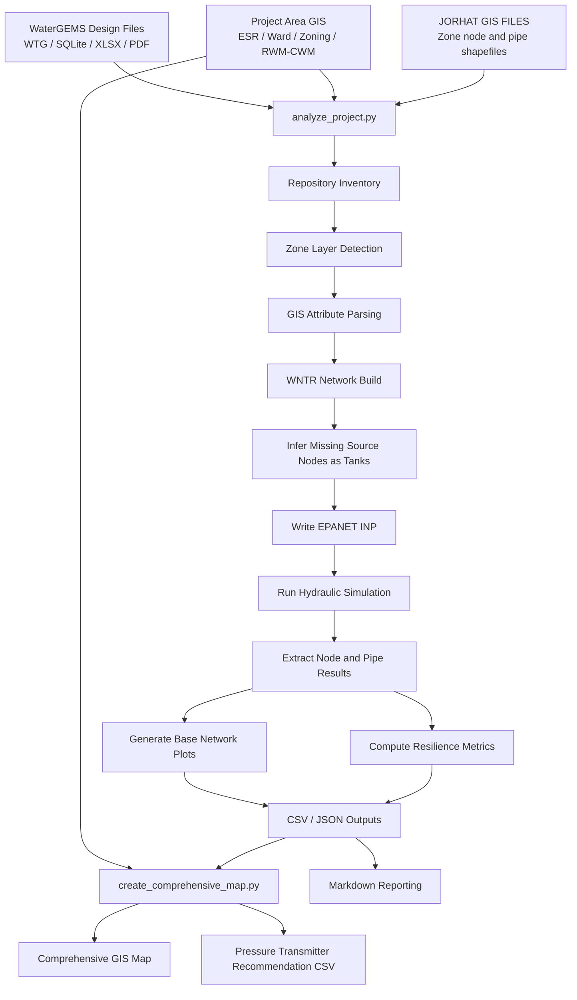

# System Architecture

## Purpose

This document describes the end-to-end architecture of the `C:\Automation\WNTR` project, including data sources, processing stages, model generation, simulation, resilience analysis, and map production.

## High-Level Architecture

```text
Raw GIS Data + WaterGEMS Design Files
                |
                v
     Repository Scan / Data Inventory
                |
                v
   GIS Layer Selection and Attribute Parsing
                |
                v
  Junction / Pipe Conversion to WNTR Network
                |
                v
 Inference of Missing Source Endpoints as Tanks
                |
                v
   EPANET INP Model Generation (.inp output)
                |
                v
     WNTR / EPANET Hydraulic Simulation
                |
                v
   Pressure / Flow / Headloss Result Extraction
                |
                +-----------------------------+
                |                             |
                v                             v
     Resilience Metric Computation     Plot / Map Generation
                |                             |
                v                             v
     CSV / JSON / Markdown Outputs   PNG / PDF / CSV Outputs
```

## Visual Pipeline



## Main Components

### 1. Source Data Layer

Inputs come from three main sources:

- Distribution GIS shapefiles in `JORHAT\GIS FILE\DIST`
- Project-area GIS context layers in `JORHAT\GIS FILE\Jorhat project area`
- WaterGEMS design files in `JORHAT DESIGN FILE`

### 2. Processing Core

The processing core is `analyze_project.py`.

Responsibilities:

- detect source files
- inspect GIS and design data
- convert zone shapefiles to a WNTR model
- infer missing sources as tanks
- write an EPANET `.inp`
- run hydraulic simulation
- compute resilience metrics
- export CSV, JSON, PNG, and markdown-ready outputs

### 3. Hydraulic Modeling Layer

The hydraulic modeling layer is based on:

- `wntr.network.WaterNetworkModel`
- `wntr.sim.EpanetSimulator`
- fallback `wntr.sim.WNTRSimulator`

The generated model is:

- `models\inp_files\jorhat_combined_distribution.inp`

### 4. Analytics Layer

Hydraulic and resilience analytics include:

- node pressure
- node head
- node demand
- pipe flow
- pipe velocity
- pipe headloss
- network reliability
- pressure deficiency
- pipe criticality
- supply redundancy

### 5. Mapping Layer

The cartographic layer is `create_comprehensive_map.py`.

Responsibilities:

- reload GIS context layers
- merge simulation results with network geometry
- highlight critical pipes
- highlight low-pressure nodes
- place ESRs and inferred tanks
- annotate recommended pressure transmitter locations
- export PNG and PDF map layouts

## Data Flow Detail

### Input to model build

```text
Zone shapefiles
  -> junction attributes: demand, elevation, HGL, label
  -> pipe attributes: diameter, roughness, length, start node, stop node
  -> geometry coordinates
```

### Model build to simulation

```text
WNTR network object
  -> hydraulic options
  -> junctions
  -> pipes
  -> inferred tanks
  -> written to EPANET INP
  -> loaded for simulation
```

### Simulation to analytics

```text
Simulation results
  -> node result tables
  -> link result tables
  -> resilience metrics
  -> inventory and assumptions
```

### Analytics to mapping

```text
results/node_pressure.csv
results/pipe_flow.csv
results/data_inventory.json
  + project-area shapefiles
  -> comprehensive system map
```

## Script Interaction Diagram

```text
analyze_project.py
  |
  |-- scans repository
  |-- builds model
  |-- runs WNTR/EPANET
  |-- writes results/*.csv
  |-- writes results/data_inventory.json
  |-- writes models/inp_files/*.inp
  |
  v
create_comprehensive_map.py
  |
  |-- reads results/*.csv and results/data_inventory.json
  |-- reads project GIS layers
  |-- creates final PDF/PNG map
```

## Primary Outputs by Stage

### Stage 1: Model generation

- `models\inp_files\jorhat_combined_distribution.inp`

### Stage 2: Hydraulic outputs

- `results\hydraulic_results.csv`
- `results\node_pressure.csv`
- `results\pipe_flow.csv`
- `results\network_metrics.csv`

### Stage 3: Inventory outputs

- `results\data_inventory.json`
- `results\data_inventory_summary.csv`
- `results\data_sources.csv`
- `results\data_template.csv`

### Stage 4: Visualization outputs

- `results\pressure_map.png`
- `results\pipe_flow_map.png`
- `results\critical_pipes.png`
- `results\critical_pipe_comprehensive_map.png`
- `results\critical_pipe_comprehensive_map.pdf`

### Stage 5: Reporting outputs

- `results\project_analysis.md`
- `PROJECT_REFERENCE.md`
- `SYSTEM_ARCHITECTURE.md`
- `DEPENDENCIES.md`
- `RUN_COMMANDS.md`

## Design Assumptions

- The distribution model is GIS-driven.
- Each zone may contain one source endpoint present in pipe GIS but absent from node GIS.
- Missing source endpoints are converted into tanks using inferred head from adjacent HGL values.
- The main hydraulic run is steady-state.
- Pressure-dependent demand is enabled.
- Project-area ESR GIS is used mainly for context mapping, not full source-topology integration.

## Known Constraints

- No `requirements.txt` or `pyproject.toml` exists in the repository.
- Several shapefiles report `CRS None`, so CRS handling is implicit rather than explicit.
- WaterGEMS spreadsheets are present but not actively parsed by the current scripts.
- Reservoir / pump / valve topology is not fully reconstructed into the EPANET model.
- `temp.bin` and `temp.rpt` are simulator-generated artifacts and not core source files.

## Recommended Future Architecture Improvements

- Add `src/` package structure and move reusable functions there.
- Add `requirements.txt` or `pyproject.toml`.
- Add formal configuration for paths, pressure thresholds, and simulation options.
- Add tests for GIS ingestion and model construction.
- Add direct extraction of reservoir, valve, and pump geometry from WaterGEMS SQLite.
- Add optional extended-period simulation with demand patterns.
